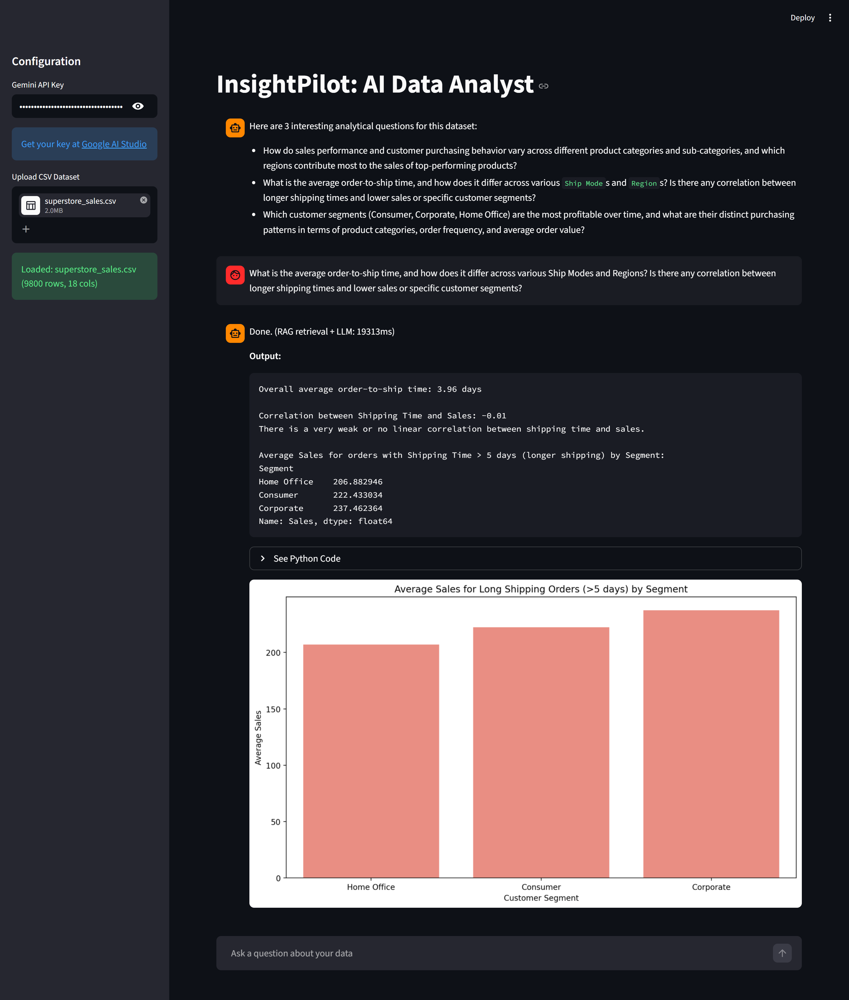
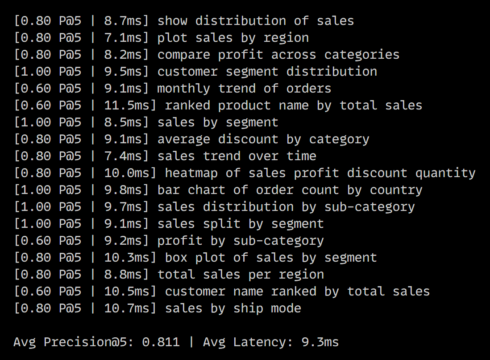

# InsightPilot: AI-Powered Data Analyst

InsightPilot is an interactive data analysis application built with Streamlit and Google Gemini. It uses a hybrid RAG pipeline (FAISS dense search + BM25 sparse search) to ground LLM prompts in actual dataset context before generating visualizations from natural language queries.



## Architecture

- RAG Pipeline: dataset rows and column statistics are chunked, embedded using `all-MiniLM-L6-v2` (512-dim), and stored in a FAISS flat index. Queries use reciprocal rank fusion over FAISS and BM25 results to retrieve the top-5 most relevant chunks before prompting the LLM.
- LLM Engine: Google Gemini 2.5 Flash receives only the retrieved context, not the raw dataframe, which significantly reduces hallucinations on large datasets.
- Visualization: the LLM generates Python code using matplotlib/seaborn, which is executed locally and rendered in the UI.

## Features

- Natural language to visualization with end-to-end latency displayed per query
- Hybrid retrieval (dense + sparse) with reciprocal rank fusion
- Supports datasets with 50+ features and 100MB+ in size
- 8 visualization types: histogram, bar, line, scatter, box, heatmap, pie, area
- Transparent code display for every generated plot
- RAG benchmark script to measure precision@5 and retrieval latency



## Tech Stack

- Frontend: Streamlit
- LLM: Google Generative AI (gemini-2.5-flash)
- Embeddings: sentence-transformers (all-MiniLM-L6-v2)
- Vector Store: FAISS (CPU)
- Sparse Retrieval: BM25 (rank-bm25)
- Data: Pandas, NumPy
- Visualization: Matplotlib, Seaborn

## Project Structure
```
├── app.py                  # Streamlit UI and session state
├── utils.py                # InsightPilotAgent: RAG retrieval + LLM orchestration
├── rag/
│   ├── embedder.py         # Chunking, embedding, FAISS index construction
│   └── retriever.py        # Hybrid search with reciprocal rank fusion
├── eval/
│   ├── benchmark.py        # Precision@5 and latency benchmarking
│   └── queries.py          # 20 ground-truth query-column pairs
└── requirements.txt
```

## Installation
```bash
git clone https://github.com/abhinavharbola/insightpilot-ai-data-analyst
cd insightpilot-ai-data-analyst
```

```bash
python -m venv venv
source venv/bin/activate        # Windows: venv\Scripts\activate
```

```bash
pip install torch --index-url https://download.pytorch.org/whl/cpu
pip install -r requirements.txt
```

## Usage
```bash
streamlit run app.py
```

1. Enter your Gemini API key in the sidebar (get one free at [Google AI Studio](https://aistudio.google.com/))
2. Upload a CSV file
3. Wait for the RAG index to build, then ask questions in the chat

## Running the Benchmark
```bash
python -m eval.benchmark --csv path/to/your/dataset.csv
```

Outputs precision@5 and average retrieval latency across 20 canonical query patterns. Update `eval/queries.py` with column names matching your dataset before running.

## Notes

- No GPU required. All embedding and retrieval runs on CPU.
- The index is rebuilt each time a new file is uploaded. For very large datasets (500MB+) this may take 30-60 seconds.
- Replace the ground-truth keywords in `eval/queries.py` with actual column names from your dataset before benchmarking.
